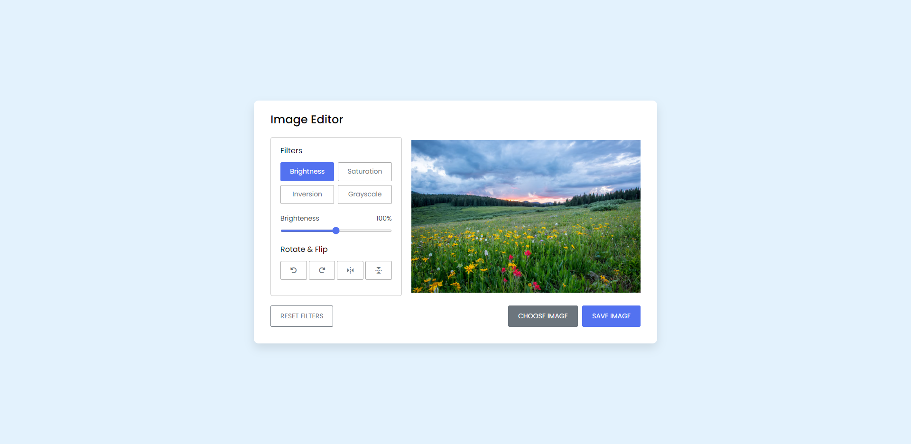
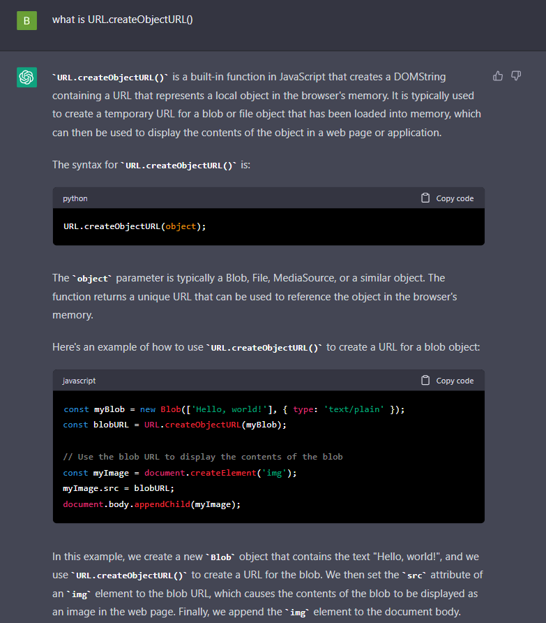
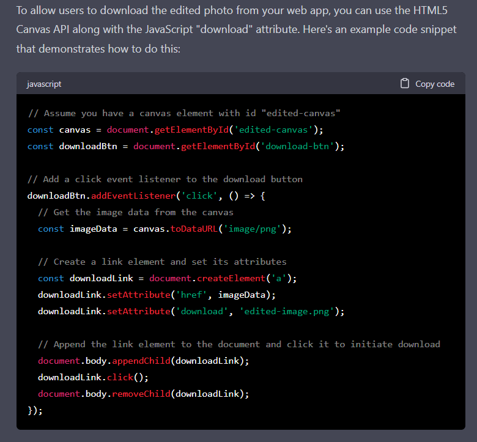

# Image Editor 📷

## Table of contents

- [Summary](#summary)
- [Screenshot](#screenshot)
- [Link](#links)
- [Built with](#built-with)

##

In this project, I have worked with DOM manipulation and built-in functions in JavaScript ✔.  
Using JavaScript to change the filters, rotates and flips of the images was really fun and also instructive 🖼.  
I like to use HTML Canvas to draw an image on a canvas ✨.  
Also, using pure-css takes the project to the next level 🚀.

## Links

<a href="https://birkan-dogan.github.io/imageEditor/">Live Version of the project</a>

## Screenshot

### Thanks to ChatGPT, I had a chance to manage better some parts of the project.

  

## Built with

- HTML
- CSS
- JavaScript

## Utility Links

> [HTML](https://www.w3schools.com/html/default.asp)  
> [CSS](https://www.w3schools.com/css/default.asp)  
> [JavaScript](https://developer.mozilla.org/en-US/docs/Web/JavaScript)  
> [HTML-Canvas](https://www.w3schools.com/graphics/canvas_intro.asp)

 Keep Building 🚀

